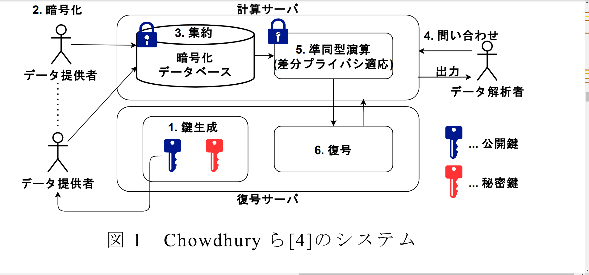
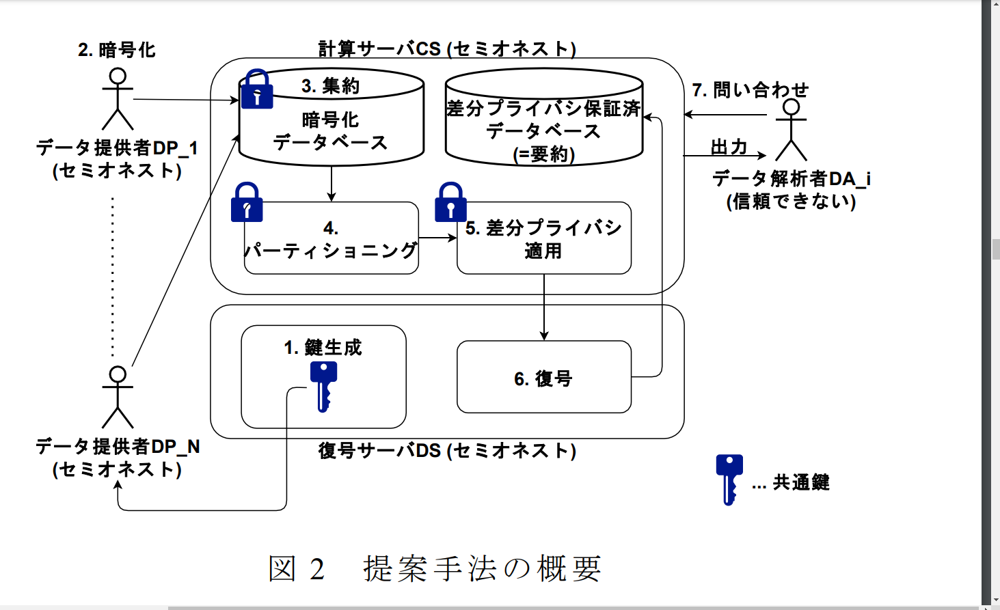
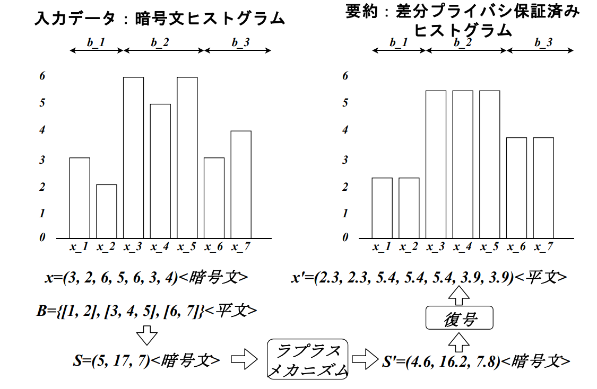

差分プライバシの関連研究と提案手法

## 適用方法
<!-- 

## 特徴と注意点 -->

| 適用方法 | 特徴 | 注意点 |
| --- | --- | --- |
| (1)データ提供者による差分プライバシの適用 | - データ提供者がプライバシー保護を行う - 元データはクラウドサーバに送信されない | - データ集約前にノイズが加算されるため、 問い合わせ応答結果に誤差が大きくなる |
| (2)クラウドサーバによる集約後の差分プライバシ適用 | - 元データを集約した後にノイズを加算 - 問い合わせ応答結果の精度が比較的高い | - クラウドサーバを信頼する必要がある |
| (3)個々のデータ解析者の問い合わせ応答ごとに差分プライバシを適用 | - 各解析リクエストに対して個別にノイズを加算 - 柔軟なプライバシー保護が可能 | - クラウドサーバを信頼する必要がある - プライバシ予算の観点から応答回数に制限が必要 |

### 関連研究
### 1. **準同型暗号と差分プライバシの組み合わせ**:

Chowdhuryら(2020)は(3)に該当する．
   <!-- - Chowdhuryら(2020)は、準同型暗号と差分プライバシを組み合わせることで、クラウドサーバ上でのデータ解析においてプライバシを保護するシステムを提案しました。このシステムは、クラウドサーバがデータを復号せずに解析を行い、結果に差分プライバシを適用することで、データ提供者のプライバシを守ります【4†source】。 -->

<!--   -->

### 課題点
- 問い合わせの応答速度が遅くなる
- 問い合わせに回数制限が生じる．

### 2.Li らの差分プライバシアルゴリズム (2014)
- **対象データ**: 1次元及び2次元のヒストグラムデータ
- **誤差**: 競合する手法と比較して低誤差を達成
- **問い合わせ**: レンジクエリのみ対象
- **構成**:
  - **パーティショニング**: ヒストグラムデータを値が近いまとまりごとに分割
  - **ノイズ加算**: 各まとまりにノイズを加算
- **メリット**: 個々のデータにノイズを加算するのではなく、まとまりごとにノイズを加算することで、全体のノイズ量を低減
<!-- - **呼称**: パーティショニングとノイズ加算処理を合わせて「DAアルゴリズム (Data-Aware Algorithm)」 -->

- Hay らによる検証で総合的に出力の誤差が小さいことを示されている
<!-- - **評価原則**: 差分プライバシアルゴリズムの評価原則を提案
- **評価フレームワーク**: 15個の差分プライバシアルゴリズムを評価
- **実験結果**: Li らのアルゴリズムは総合的に出力の誤差が小さいことを示した
 -->

### 提案手法
目的
- データ提供者が所有するデータをクラウドサーバ及びデータ解析者の両者から保護する，
- 準同型暗号に起因する応答速度低下の問題と，差分プライバシに起因する応答回数制限の問題 を解決する．

 <!-- **エンティティ**:
 1. データ提供者 (DP_j, 1≤j≤N)
- 人数: N人 (≧1)
- **役割**:
  - 復号サーバから受信した共通鍵を用いて自身のデータを暗号化し、計算サーバに送信する。
  - データ送信後、システムに関与しない。
- **仮定**: セミオネスト (システムプロトコルには従うが、データを盗み見ようとする可能性あり)

 2. 計算サーバ (CS)
- **役割**:
  - データ提供者から受信した暗号化データに対して、完全準同型暗号下でデータの集約と差分プライバシの適用を行う。
  - 復号サーバと協力して、差分プライバシを保証したデータの要約を構築する。
  - 保存されるデータは、完全準同型暗号及び差分プライバシのいずれか、または両方によって保護される。
- **仮定**: セミオネスト、他のエンティティと共謀しない

3. 復号サーバ (DS)
- **役割**:
  - 鍵の生成と、計算サーバから受信する暗号文データの復号を行う。
  - 復号するデータには差分プライバシが保証されているため、元データを知ることはできない。
- **仮定**: セミオネスト、他のエンティティと共謀しない

4. データ解析者 (DA_i, 1≤i≤M)
- **人数**: M人 (Mは1以上の整数)
- **役割**:
  - 多数の問い合わせを行うことで、元データに対して統計的な推測を試みる。
  - 計算サーバに対して問い合わせを行い、応答を得る。
- **仮定**: 信頼できないエンティティ -->

## 提案手法のエンティティと役割

| エンティティ              | 人数                      | 役割                                                                                                                                  | 仮定                                               |
|-----------------------|-------------------------|-----------------------------------------------------------------------------------------------------------------------------------|------------------------------------------------|
| データ提供者 (DP_j, 1≤j≤N)  | N人 (≧1)         | - 復号サーバから受信した共通鍵を用いてデータを暗号化し、計算サーバに送信 - データ送信後、システムに関与しない                                                                 | セミオネスト (プロトコルには従うがデータを盗み見ようとする可能性あり) |
| 計算サーバ (CS)            | -                       | - データ提供者から受信した暗号化データに対して、完全準同型暗号下でデータの集約と差分プライバシの適用 - 復号サーバと協力して差分プライバシ保証データの要約を構築 - データは常に保護される | セミオネスト、他のエンティティと共謀しない                      |
| 復号サーバ (DS)            | -                       | - 鍵の生成と計算サーバから受信する暗号文データの復号 - 復号データには差分プライバシが保証され、元データを知ることはできない                                               | セミオネスト、他のエンティティと共謀しない                      |
| データ解析者 (DA_i, 1≤i≤M) | M人 (≧1)         | - 多数の問い合わせを行い、元データに対して統計的推測を試みる - 計算サーバに対して問い合わせを行い、応答を得る                                                 | 信頼できないエンティティ                                    |

   <!-- - データ提供者は、復号サーバから受信した共通鍵を用いてデータを暗号化し、計算サーバに送信します。計算サーバは、この暗号化データに対して準同型演算を行い、データの集約と差分プライバシ適用を行います。復号サーバは、計算サーバから受信したデータを復号します -->

## 提案手法の手順

1. **鍵生成**: 復号サーバ (DS) が鍵を生成し、共通鍵をデータ提供者 (DP_j) に送信する。
2. **暗号化**: DP_j は共通鍵を用いてデータを暗号化し、計算サーバ (CS) に送信する。
3. **集約**: CS はDP_jから受信した暗号化データを準同型演算で集約(合計)する。
4. **パーティショニング**: CS は集約した暗号化データをパーティショニングし、復号サーバを使用して平文で結果を得る。
5. **差分プライバシ適用**: CS はパーティショニング後のまとまりごとにノイズを加算し、ノイズ加算後の暗号文データをDSに送信する。
6. **復号**: DS はCSから受信した暗号文を復号し、復号したデータをCSに送信する。
7. **問い合わせ**: データ解析者 (DA_i) はCSに問い合わせを行い、応答結果を得る。

| プライバシパラメータ | 役割  | 詳細      |
|------------------------|------------------------------------|----------------------------------------------|
| 𝜖1  | パーティショニングのノイズ | データの分割処理でプライバシを保護するためにノイズを加える。 |
| 𝜖2 | ノイズ加算のノイズ| 分割された各まとまり（バケット）のデータにノイズを加える。 |

## 完全準同型暗号下での差分プライバシ適用

- **ヒストグラムの構成要素**
  - **横軸（ドメイン）**: 各評価項目やカテゴリを表す。
  - **縦軸（数値データ）**: 各ドメインに対応する数値を示す。

<!-- - **バケットとパーティション**
  - **バケット**: ドメインを区切る区画。例: [3, 4, 5, 6]。
  - **パーティション**: バケットの集合。 -->

- **ヒストグラムの数値データ**
  - ドメイン数 $n $ の場合、数値データ $\boldsymbol{x} $ は $\boldsymbol{x} = (x_1, x_2, ..., x_n) $ で表される。

- **バケットごとの数値データの合計**
  - 各バケット $b_j $ 
  - 合計値 $\boldsymbol{S} = (s_1, s_2, ..., s_k) $ 
  - 合計値 $s_j = \sum_{i \in b_j} x_i $。(バケット $b_j $ 内の数値データ $x_i $ の合計)

- **差分プライバシーの適用**
  - 合計値 $S $ にノイズを加えた $S' $ を生成。
  - $S' $ を復号サーバに送信し、復号サーバが $S' $ を復号して計算サーバに返す。

  - $S' $ をバケットの要素数で割り、均一に分配。
  <!-- - 例: $s'_j = 10 $、バケット $b_j = [3, 4, 5, 6] $ の場合、均一展開後のデータは $(2.5, 2.5, 2.5, 2.5) $。 -->

- **データ解析への利用**
  - 均一展開されたデータ $x' $ を用いて、データ解析者からの問い合せに応答。
<!-- 
- **例**
  - ヒストグラムのドメイン数 $x = (3, 2, 6, 5, 6, 3, 4) $。
  - パーティション $B = {[1, 2], [3, 4, 5], [6, 7]} $。
  - 合計値 $S = (5, 17, 7) $。
  - ノイズ適用後の合計値 $S' = (4.6, 16.2, 7.8) $ を均一展開すると $x' = (2.3, 2.3, 5.4, 5.4, 5.4, 3.9, 3.9) $。 -->

### 具体例
- 入力データ: 𝒙 = (𝟑, 𝟐, 𝟔, 𝟓, 𝟔, 𝟑, 𝟒)
- パーティション: 𝑩 = {[𝟏, 𝟐], [𝟑, 𝟒, 𝟓], [𝟔, 𝟕]}
- バケットごとの合計値: 𝑺 = (𝟓, 𝟏𝟕, 𝟕)
- 差分プライバシ適用後: 𝑺′ = (𝟒. 𝟔, 𝟏𝟔. 𝟐, 𝟕. 𝟖)
- 均一展開後のデータ: 𝒙′ = (𝟐. 𝟑, 𝟐. 𝟑, 𝟓. 𝟒, 𝟓. 𝟒, 𝟓. 𝟒, 𝟑. 𝟗, 𝟑. 𝟗)
1. **入力データ**
     - 数値データ $\boldsymbol{x} = (3, 2, 6, 5, 6, 3, 4) $
     - パーティション $B = \{[1, 2], [3, 4, 5], [6, 7]\} $

  2. **バケットごとの数値データの合計**
     - $s_1 = x_1 + x_2 = 3 + 2 = 5 $
     - $s_2 = x_3 + x_4 + x_5 = 6 + 5 + 6 = 17 $
     - $s_3 = x_6 + x_7 = 3 + 4 = 7 $
     - 合計値 $\boldsymbol{S} = (5, 17, 7) $

  3. **差分プライバシーの適用**
     - ノイズを加えた後の合計値 $\boldsymbol{S'} = (4.6, 16.2, 7.8) $

  4. **均一展開**
     - $b_1 = [1, 2] $: $s'_1 = 4.6 $ を 2 つのドメインに分配 → $x'_1 = 2.3, x'_2 = 2.3 $
     - $b_2 = [3, 4, 5] $: $s'_2 = 16.2 $ を 3 つのドメインに分配 → $x'_3 = 5.4, x'_4 = 5.4, x'_5 = 5.4 $
     - $b_3 = [6, 7] $: $s'_3 = 7.8 $ を 2 つのドメインに分配 → $x'_6 = 3.9, x'_7 = 3.9 $
     - 均一展開後のデータ $\boldsymbol{x'} = (2.3, 2.3, 5.4, 5.4, 5.4, 3.9, 3.9) $

**評価実験**:
   - 提案手法の評価実験では、要約構成時間と精度の観点から実験を行っています。結果として、ドメインサイズが大きくなると要約構成時間が指数的に増加する一方で、ビット数の増加には線形に対応できることが示されました。また、ノイズによる誤差が小数部分のビット数に依存しないことが確認された

### 技術メモ
- **DAアルゴリズム**: ヒストグラムに対するレンジクエリの誤差を低減するアルゴリズム。  
今回は1次元のデータに適用
- **パーティショニング**: ヒストグラムデータを値が近いまとまりごとに分割し、ノイズを加算
- **ラプラスメカニズム**: 各バケットの合計値に対してノイズを加算し、差分プライバシを保証。
- **TFHE (Torus Fully Homomorphic Encryption)**: 暗号文上で絶対値や最小値を取得するために使用。バイナリゲートで高速なブートストラッピングを実現。